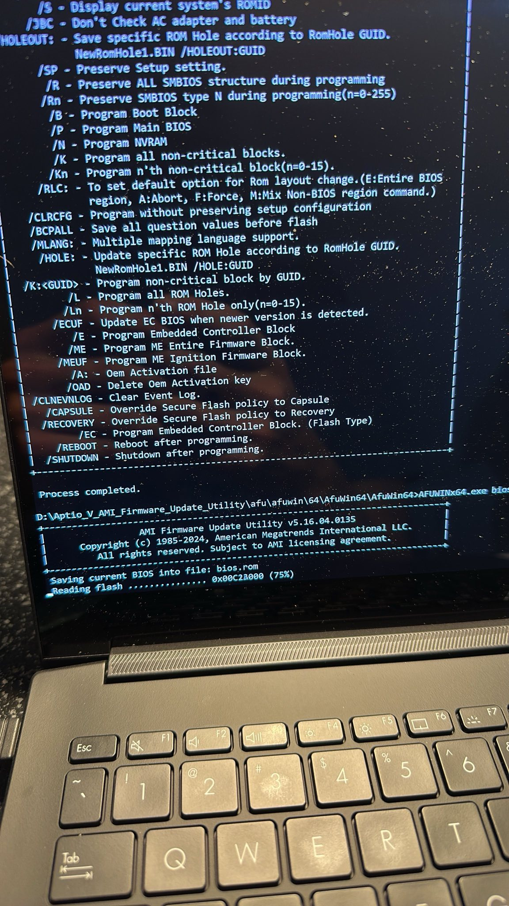

# Recovering the UEFI/BIOS admin password on an ASUS laptop without OS access

My uncle had a fairly expensive ASUS laptop and he forgot his Windows password.
Normally I would simply recommend recovery via Microsoft account, but this was
not possible because he disabled it. He said he didn't have anything important
on the laptop, so I went to reinstall Windows...only to find he had also set
the admin password on the BIOS and didn't remember it.

So this presented quite a pickle: no OS user access, and no UEFI BIOS access. And no
idea what he had messed in the BIOS, so we were operating paritally in the dark.
Not having BIOS access doesn't sound so bad, but once you try to do something
like reinstall the OS it gets really annoying, really fast because you can't set a boot priority.

- Model tested: ASUS Q540V
- BIOS version: 311 (2024/07/19)

## When this works

This recovery method works with the following constraints:

- Does not use Alt+R and then a password method (you should definitely look at
  [this method](https://www.biosbug.com/asus/) first, it is far easier)
- Does not require password access to a Windows environment
- Requires an AMI BIOS to use the [AMI BIOS Utilities](https://www.ami.com/bios-uefi-utilities/)

You will need:

- A BIOS/UEFI that boots from the default drive slot
- A DOS or Windows recovery environment installed on the drive
  - You could also probably do this from the EFI and use the AFUEFI tool but I did not test this
- A flash drive
- Another working computer

## Procedure

### 0. (Optional) Figure out what BIOS type you have, Linux side quest

I did this by swapping the drive in the default slot with a drive that had Linux pre-installed. This allowed me to run `dmidecode -t bios` to see the vendor and BIOS version. Most importantly, we should be able to see American Megatrends International as the BIOS vendor. This guide only works on AMI BIOS because it depends on the AMI utilities.

You could potentially dump the BIOS here using `flashrom -p internal -r dump.bin` but I ran into issues with Linux being unhappy I was trying to read protected memory. I also realized there are strangely no AFULNX binaries in the AMI Utilities, despite mentions of it existing. I decided this was a dead end, but looking back I probably could have succeeded at a BIOS dump by adjusting some OS security settings.

### 1. Create a flash drive

- Format the drive as FAT32
- Download the AMI BIOS utilities. I used the Aptio V AMI Firmware Update
     Utility as it is generally present on newer systems after ~2011. Extract
     the contents to the flash drive.
- Go to afu > afuwin > 64. Extract `AfuWin64.zip`. You might want to look at the `README.txt` in this directory.
- The flash drive is ready. Be a good boy or girl and eject your drive.

### 2. Boot into the Windows recovery environment

- If you're already in Windows but can't log in, normally you can hold the shift key down and click restart to get to the RE. This didn't work for me, so I swapped in a drive with a fresh Windows install. And (speculating here) because I did this install on a device without Intel VMD, I got an INACCESSIBLE_BOOT_DEVICE BSOD on first boot and then it went to the RE afterwards after a restart...which actaully worked in my favor because that was where I wanted to be. It's interesting how this failure mode can be leveraged for future steps.
- In any case, here we are. Go to Troubleshoot > Advanced options > Command Prompt.
- Run `wmic logicaldisk get name` to see the attached disks.
- Now attach the flash drive and run the command again. Whichever new entry appears, run `cd <entry>`.
- Run `cd Aptio_V_AMI_Firmware_Update_Utility\afu\afuwin\64\AfuWin64\AfuWin64`.
- Run `AFUWINx64.exe bios.rom /O` to dump the BIOS.
- You should get a screen like this: 
- Assuming nothing crazy happens, the file is now saved to the drive. You can shut down the computer.

### 3. Decrypt the BIOS

- Bring the flash drive to a working computer.
- Do one of the following:
  - (Easy) Upload the BIN file [here](https://alien.raaz.info.np/server/unlock/AMITSESetup/). You need to rename `bios.rom` to `bios.bin`.
  - (Slightly harder, requires account) Use the Python script [here](https://www.badcaps.net/forum/troubleshooting-hardware-devices-and-electronics-theory/troubleshooting-laptops-tablets-and-mobile-devices/bios-requests-only/90500-amitsesetup-decryptor).
- Say "ahhh, that's what the password was" and enjoy.

## Credit

This writeup was inspired by [this guide](https://rog-forum.asus.com/t5/tuf-asus-gaming-notebooks/guide-to-decrypt-admin-level-bios-uefi-password-on-newer-model/td-p/994023) and builds upon it by not requiring OS access.
